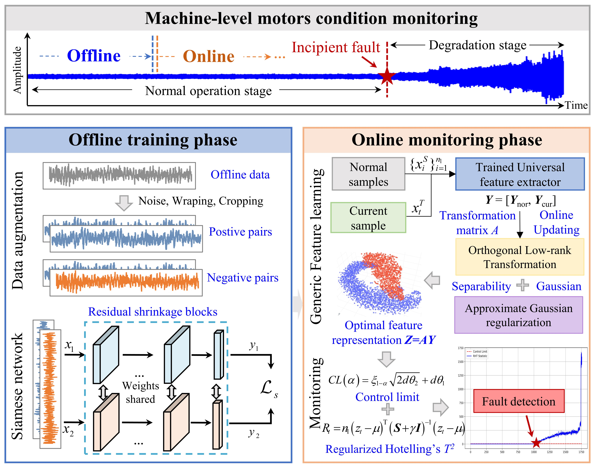
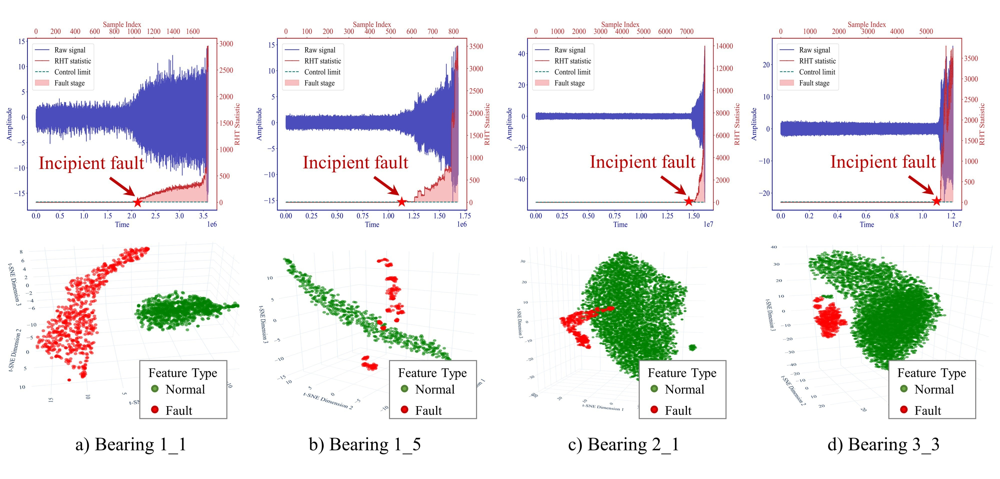

# Generic featurelearning for condition monitoring
This is the repository to the paper "[Online unsupervised condition monitoring for machine-level motors using a generic feature learning method]", which is currently be reviewed on **_IEEE Transcations on Reliability_**.

**_Abstract_** 
This paper proposes a novel online unsupervised condition monitoring framework for machine-level motors. In the offline phase, a Siamese network-based feature extractor is utilized to learn robust feature representations solely from normal operational data. In the online phase, an orthogonal low-rank transformation is introduced to enhance the separability of normal and faulty features, while a regularization term ensures that the learned features approximate a Gaussian distribution, thereby improving model generalization in evolving operational conditions. A dynamic monitoring strategy is then developed to construct real-time statistical indicators based on the learned Gaussian features. These indicators are continuously updated as new data is received, enabling adaptive, real-time fault detection without the need for labeled fault data.

**_Framework_** 

**_Online updating algorithm_** 

**_Result_** 

## Getting Started

You will need [Python 3.11](https://www.python.org/downloads) and the packages specified in _requirements.txt_.
We recommend setting up a [virtual environment with pip](https://packaging.python.org/guides/installing-using-pip-and-virtual-environments/)
and installing the packages there.

## Data
The XJTU-SY dataset can be downloaded from (https://github.com/WangBiaoXJTU/xjtu-sy-bearing-datasets)

## License

This project is licensed under the MIT License.

 
